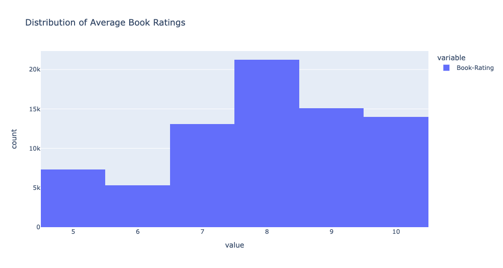
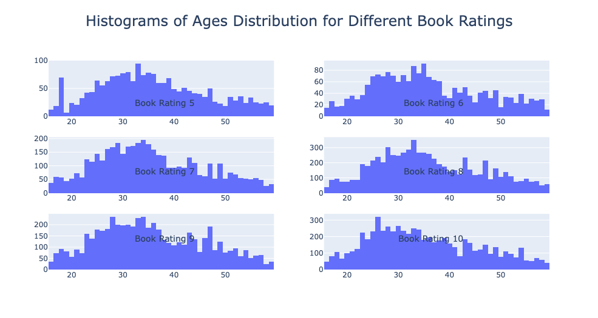
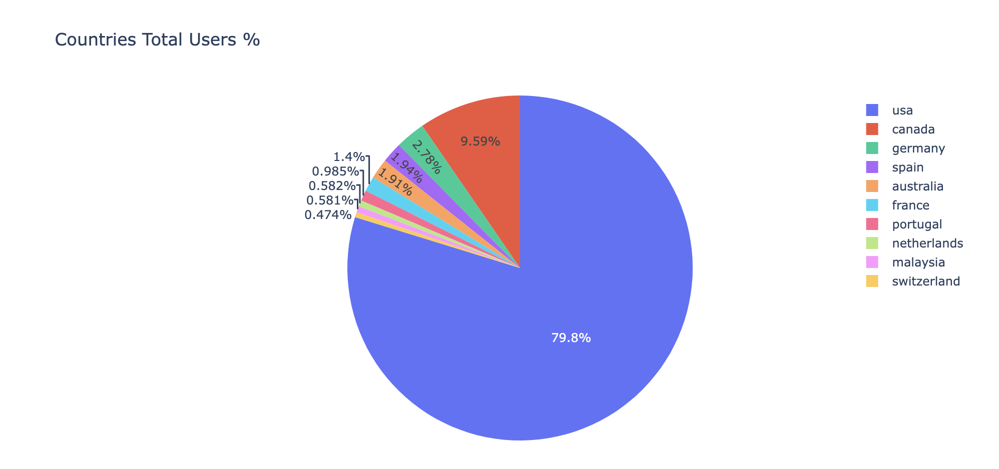
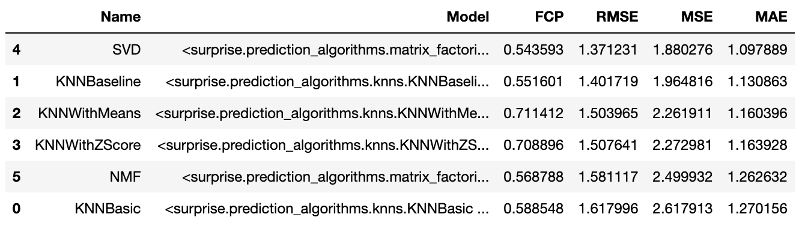
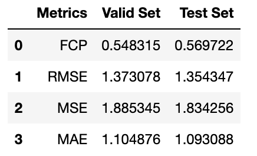

# Book Recommendation System

## Problem Overview

A startup is planning on launching a books care package monthly subscription system where the user will be delivered 5 books every quarter. The user will have the option to return whichever books they do not intend to keep within 7 days of receiving. Therefore it is crucial to ensure that the books delivered match the customer's preference otherwise returns can cause significant losses.
 
The intention is to use the ratings that users have given previous books to compute the 5 books that will be delivered. The task s to build a recommendation system that can take in certain features of the user and their history of book ratings and recommend the Top 5 books for that user.

## Data Sources

The following dataset is used to create a recommendation system. 
1. Ratings: https://www.kaggle.com/datasets/arashnic/book-recommendation-dataset?select=Ratings.csv 
2. Books: https://www.kaggle.com/datasets/arashnic/book-recommendation-dataset?select=Books.csv 
3. Users: https://www.kaggle.com/datasets/arashnic/book-recommendation-dataset?select=Users.csv 

This dataset contains data on more than 200,000 users with demographic information collected from the reputable Book-Crossing community. It has also been cleaned to a certain extent which gives us leverage to focus more on the modeling part. This dataset contains features that are readily available and will not make it extremely difficult for the company to expand the dataset. 

## Data Cleaning and EDA

The normal data cleaning was done for missing values and outliers in conjunction with Exploratory Data Analysis. There were almost 40,000 records with no rating which were used to evaluate the recommendation system. 27,000 records had ratings available therefore they were used for training, validation, and testing purposes.

A few important things that were discovered and formed the basis of filtering for data are listed below.

### Number of Reviews
The majority of books have less than 100 reviews and between 1-4 reviews.

We did “CI” calculations systematically for a large number of books at a fixed level of confidence: 95%. What this means is, that we can expect the “true” ratings for the books (after thousands of further ratings) to still lie within those earlier Confidence Intervals in 95% of cases. 

We ran a bootstrap method to see which number of ratings will work. We ran the maximum number of ratings to see how they will perform and how widespread the confidence interval can be. 

We found that number of ratings greater than 19 have a tight of ~1.4 or less.

### Average Rating
The average rating of books was between 7-9, mostly 8, as can be seen below.

### Age ranges
The age ranges focused on for analysis were 16-60 but the majority of the data was between ages 25-40 for book ratings between 5-10. This can be seen in the graph below.

### Countries
Almost 80% of the data was dominated by US users. Therefore the recommendation system was geared towards the US population

## Modeling and Results

The following models were tested and compared. The models and the evaluation metrics employed can be seen in the picture below. 

RMSE was chosen as the main metric to select the final model because accuracy is important in predicting the ratings for unknown data. The top books were ranked based on the predicted ratings. 

As shown in the table below, SVD was the top performing and was chosen as the final model.

The final model results are shown in the table below.

## Recommendation System
A recommendation system was created using the final model and collaborative filtering methods. The results of the recommendation system for User ID 40889 were as follows:

Top 5 Books recommended:
1 Harry Potter and the Sorcerer's Stone (Harry Potter (Paperback))
2 Harry Potter and the Chamber of Secrets (Book 2)
3 The Hunt for Red October
4 The Da Vinci Code
5 Seabiscuit: An American Legend

---------------------------------------------------------------------------------------------------------

Top Books originally rated by user:
1 The Purpose-Driven Life: What on Earth Am I Here For?
2 The Hobbit: The Enchanting Prelude to The Lord of the Rings
3 Tuesdays with Morrie: An Old Man, a Young Man, and Life's Greatest Lesson
4 The Partner
5 Sea Swept (Quinn Brothers (Paperback))
6 Message in a Bottle
7 Rising Tides
8 Chicken Soup for the Soul (Chicken Soup for the Soul)
9 Heart of the Sea (Irish Trilogy)
10 The Lord of the Rings (Movie Art Cover)
11 The Deep End of the Ocean (Oprah's Book Club (Hardcover))
12 Jewels of the Sun (Irish Trilogy)

## Conclusion
This recommendation system model would be great to use as a baseline model for the MVP product for the startup in the user discovery phase. It is limited to the US customer base and for expanding it to a global market, more global data will have to be gathered to build a model with an accurate and confident recommendation system. Nonetheless, the startup can build up on this model through user feedback, incorporating more diverse data, and implementing the recommendations mentioned below.

## Recommendations and Next Steps
While the recommendation system provides valuable good recommendations, there is a lot of room for improvement. The RMSE scores are still relatively high and there were a lot more records in the missing ratings dataset as compared to the known ratings dataset. The performance can be significantly improved by gathering more data and building granular user and product personas, such as genre, demographic, and other information. This would give the model more detailed information to predict from.

Moreover, incorporating a hybrid approach of content-based and user-based collaborative filtering would be beneficial. Currently, user-based collaborative filtering is used but using content based would also help. For content-based filtering, it would also be important to gather more data.

Also, the current models can be further optimized using more parameters to find a further optimal solution. This can help bring the RMSE score further down and help to improve the model performance. 

Lastly, incorporating a solution for the cold start problem would allow the incorporation of new users who do not have prior rating data. A feedback loop can also be added to update the ratings as users return or rate the new books. This way a constantly updated model will improve performance based on new data.

---------------------------------------------------------------------------------------------------------------------------------
## MORE INFORMATION:
Please use the following links to get more information:
1. Click [here](https://github.com/shayanabdulkarimkhan/book-recommendation-system/blob/main/notebook.ipynb) to see the full analysis 
2. Click [here](https://github.com/shayanabdulkarimkhan/book-recommendation-system/blob/main/pdfs/Stakeholder%20Presentation.pdf) to see the overview presentation.

Please feel free to contact me at shayan.khan@nyu.edu with any questions, comments or concerns.

---------------------------------------------------------------------------------------------------------------------------------
├── pdfs
├── pics
├── notebook.ipynb
├── Stakeholder_Presentation.pptx
└── README.md
